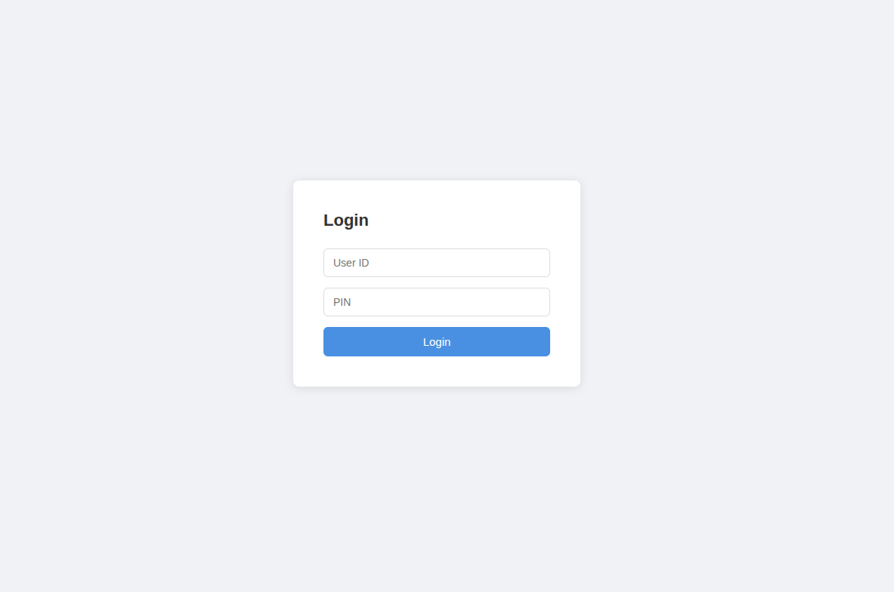

# 🍗 Restaurant Management System (RMS)

## 🚀 Live Features
- Staff login system
- Add daily sales (cash, card, delivery)
- Backend API with Flask
- Simple frontend (HTML, CSS, JS)

## 🛠 Tech Stack
- Python (Flask)
- SQLite
- HTML / CSS / JavaScript

## 📸 Screenshots

## ⚙️ How to Run
1. Clone repo
2. Install dependencies:
   pip install flask flask-cors
3. Run:
   python app.py
4. Open frontend/index.html

## 📈 Future Improvements
- Dashboard with charts
- Stock management system
- Multi-delivery platform tracking
- AI sales prediction

## 👨‍💻 Author
Kugathas Ganeshan
